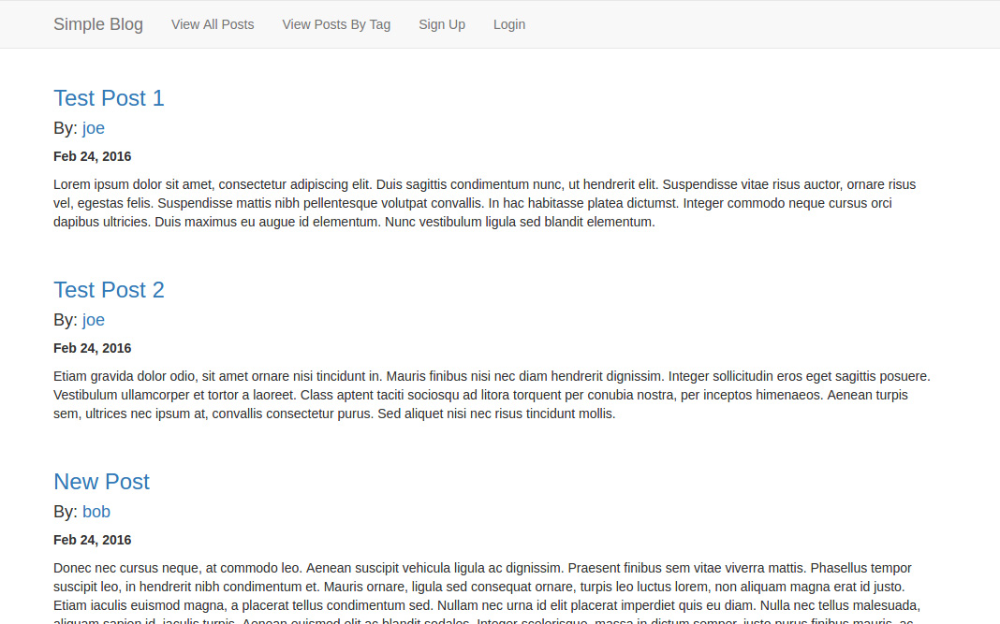

# Sinatra Simple Blog
A blog leveraging the Sinatra MVC framework.

## Install Instructions
Run `bundle install` to install dependencies. Run `bundle exec rake db:create` and `bundle exec rake db:migrate` to create and migrate the database. Then run `shotgun` to start the shotgun development server. 
